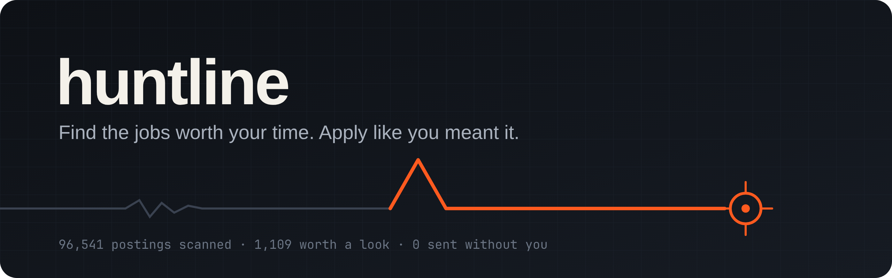
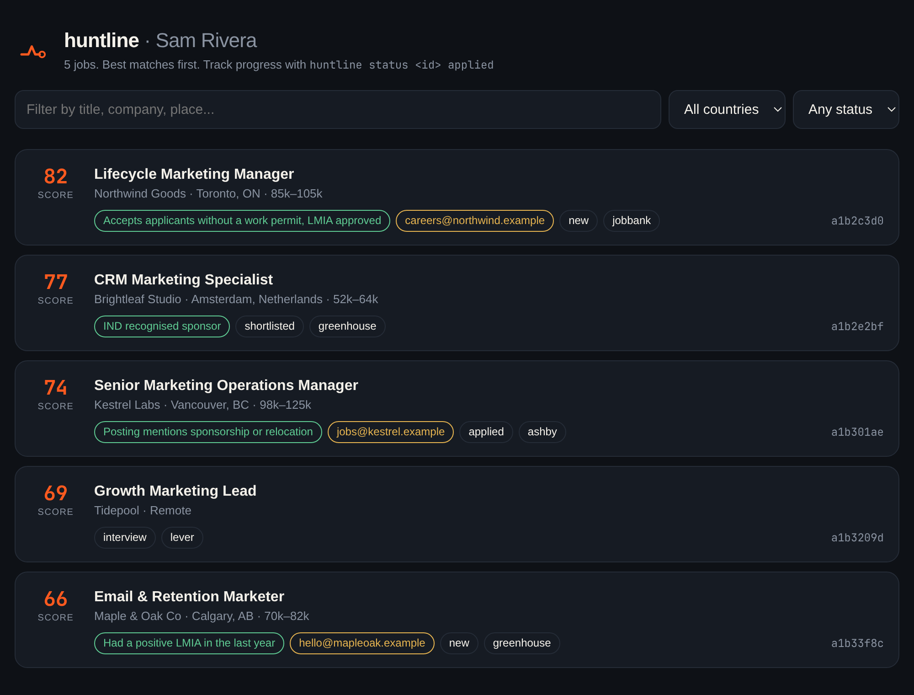
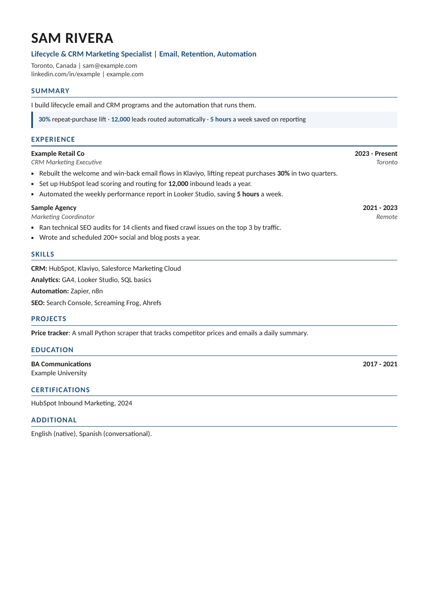
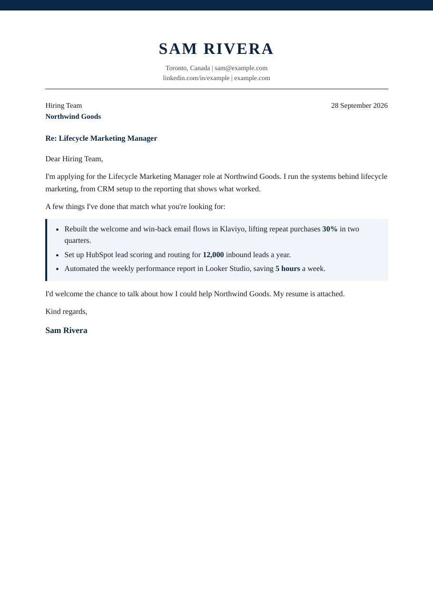
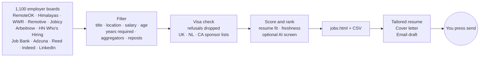

<p align="center">
  
</p>

<p align="center">
  <a href="https://github.com/anirudhprashant/huntline/actions"></a>
  
  
  
  
</p>

<p align="center">
  <b>Huntline</b> reads about 100,000 job postings a day, keeps the few that fit you,<br>
  and gets each one ready to apply with a tailored resume, a cover letter and an email draft.<br>
  Free, open source, runs on your laptop. It never sends anything without you.
</p>

<br>

<p align="center"></p>

## Why

Job boards show you everything. You need a short list. Huntline goes straight to the
source, about 1,100 employer career pages, and filters hard. Titles have to fit, salaries
have to clear your floor, and aggregators and reposts are dropped. Every job gets a score,
and the best ones come first.

If you need a visa, it goes further. Postings that say "no sponsorship" are removed. The
employers that remain are checked against official government sponsor lists, so a
posting that could actually hire you rises to the top.

## Quick start

You need **Python 3.10+** and **Chrome** (or Chromium, Edge or Brave).

```bash
pipx install git+https://github.com/anirudhprashant/huntline
mkdir my-job-hunt && cd my-job-hunt
huntline init                    # 7 quick questions
```

Put your real experience into `resume.yaml`. Then:

```bash
huntline scout                   # a few minutes the first time
```

Open **`out/jobs.html`**. That's your list. Or run `huntline serve` to use it as a local
app, where one click shortlists a job or builds its resume and cover letter.

## Let your AI agent set it up

Using Claude Code, Codex, Cursor or another coding agent? Paste this in and it does the
whole setup, asking you only for what it can't know.

<details open>
<summary><b>Copy this prompt</b></summary>

```text
Set up Huntline (https://github.com/anirudhprashant/huntline) for me: a local job-search
tool that finds jobs that fit me, then makes a tailored resume, cover letter and email
draft for each. Read its README first. Work step by step and tell me what you're doing.

1. Check I have Python 3.10+ and Chrome, Chromium, Edge or Brave. Install what's missing.
2. Install it: pipx install git+https://github.com/anirudhprashant/huntline
   (install pipx first if needed). Create a folder ~/job-hunt and work inside it.
3. Interview me, one question at a time: my name, email, phone (optional), city,
   LinkedIn/portfolio links, the job titles I want, which countries I'd work in
   (canada, uk, netherlands, germany, ireland, usa, australia, india, remote),
   whether I need visa sponsorship, my minimum salary per country, and my years of
   relevant experience (search.years_experience).
   Then run `huntline init` and edit profile.yaml with my answers.
4. Ask me to paste my current resume or give you the file. Rewrite resume.yaml from it.
   RULE: only facts that are in my resume. Never invent numbers, employers, tools,
   dates or credentials. Keep every true bullet; tailoring will pick the best ones.
   Show me the result and fix anything I flag.
5. Offer these optional extras one at a time. Explain each in one line and skip any I decline.
   Put the keys in ~/job-hunt/.env (see .env.example) and nowhere else.
   - AI cover letters: a StepFun Step Plan key (cheapest good option,
     https://platform.stepfun.ai). Set OPENAI_API_KEY=<key>,
     OPENAI_BASE_URL=https://api.stepfun.ai/step_plan/v1, HUNTLINE_MODEL=step-3.7-flash.
     Any other OpenAI-compatible provider also works.
   - Better contact emails: a free Brave Search API key (https://brave.com/search/api),
     set as BRAVE_API_KEY.
   - JavaScript-heavy company sites: self-host Firecrawl with Docker
     (https://github.com/firecrawl/firecrawl, `docker compose up -d`), then set
     FIRECRAWL_URL=http://localhost:3002.
   - Drafts straight into Gmail: a Gmail app password
     (https://myaccount.google.com/apppasswords), set as GMAIL_ADDRESS + GMAIL_APP_PASSWORD.
   - More job sources: free Adzuna keys (developer.adzuna.com), a Reed key for the UK, and
     `pipx inject huntline python-jobspy` for Indeed and LinkedIn.
   - Phone alerts for great new matches: pick a private topic name for the ntfy app
     (https://ntfy.sh) and set NTFY_TOPIC, or a Discord/Slack webhook or Telegram bot.
6. Run `huntline doctor`, fix anything it flags, then run `huntline scout`.
7. Open out/jobs.html and summarise my top 10 matches: title, company, score,
   and any visa evidence.
8. Ask if I want a daily 8am run. If yes, add a cron job (Mac/Linux) or a scheduled task
   (Windows) that runs `huntline scout` in ~/job-hunt.
9. If I set up an AI key, run `huntline rank --ai` and show me `huntline top --sort ai`.
10. Show me how to apply: `huntline serve` (click-to-apply list), `huntline resume <id>`,
   `huntline letter <id> [--ai]`, `huntline drafts`, `huntline status <id> applied`.

Never send an email or submit an application for me. Drafts only; I press send.
```

</details>

## From list to application

```bash
huntline top                     # best open matches in the terminal
huntline show a1b2               # one job in full (ids can be shortened, like git)
huntline rank --ai               # a model screens your top 25 against your resume
huntline serve                   # the list as a local app with working buttons
huntline resume a1b2c3d0         # resume PDF tailored to that job
huntline letter a1b2c3d0         # one-page cover letter PDF
huntline drafts                  # email drafts for your top 10, both PDFs attached
huntline status a1b2c3d0 applied # track it
```

<p align="center">
  &nbsp;&nbsp;
  
</p>

## How it works



## What makes it different

| | |
|---|---|
| **Honest resumes** | Tailoring only reorders what you wrote. The most relevant bullet leads each role, and the most relevant skills come first. It never writes a claim you didn't make. |
| **Visa aware** | Checks the UK Home Office sponsor register, the Dutch IND register and Canada's LMIA employer lists, all downloaded straight from the government sources. Canada Job Bank's Temporary Foreign Workers stream is searched too, immigration consultancies are dropped, and postings that accept applicants without a work permit are ranked first. |
| **Straight from the source** | Greenhouse, Lever, Ashby, SmartRecruiters, Workable and Recruitee boards give the real employer and the full description, with no reposts. `huntline boards` finds more boards in your countries. |
| **You stay in control** | Drafts go to your Gmail Drafts folder, or become `.eml` files. Nothing is sent, and nothing is submitted for you. |
| **Ranks by you, not keywords** | Each posting is scored against your resume: the tools you list that it names, and how much of your experience it shares. Fresh postings rank higher, stale ones are dropped, and roles asking for far more years than you have are skipped. `huntline rank --ai` adds a recruiter-style screen with the reason and the biggest gap. |
| **Knows when a job is gone** | Employer boards list every open role, so when a job you saw disappears from a board that still answers, it's marked closed and kept out of your drafts. |
| **Doesn't fail silently** | If a source that usually returns results suddenly returns zero, you're told. |
| **Nothing to sign up for** | No account, no server, no paid API. Everything optional stays optional. |

## Optional extras

| Add | How |
|---|---|
| Indeed + LinkedIn | `pipx inject huntline python-jobspy`, then add `jobspy` to `sources` |
| Adzuna (UK, CA, NL, DE, US, AU, IN) | Free key from developer.adzuna.com, set as `ADZUNA_APP_ID` + `ADZUNA_APP_KEY` |
| Reed (UK) | Free key from reed.co.uk/developers, set as `REED_API_KEY` |
| Drafts straight into Gmail | A Gmail [app password](https://myaccount.google.com/apppasswords), set as `GMAIL_ADDRESS` + `GMAIL_APP_PASSWORD` |
| AI-drafted cover letters | `huntline letter <id> --ai`. Cheapest: a [StepFun Step Plan](https://platform.stepfun.ai) key with `OPENAI_BASE_URL=https://api.stepfun.ai/step_plan/v1` and `HUNTLINE_MODEL=step-3.7-flash`. Any OpenAI-compatible provider works |
| Better contact emails | Free [Brave Search API](https://brave.com/search/api) key as `BRAVE_API_KEY`: finds the employer's real website |
| JavaScript-heavy sites | [Self-host Firecrawl](https://github.com/firecrawl/firecrawl) and set `FIRECRAWL_URL=http://localhost:3002` |
| AI fit screening | `huntline rank --ai` with the same key as AI letters. Scores, reasons and gaps show up in `jobs.html` and `huntline top --sort ai` |
| Alerts after each run | `NTFY_TOPIC` (the free [ntfy](https://ntfy.sh) phone app), `DISCORD_WEBHOOK_URL`, `SLACK_WEBHOOK_URL`, or `TELEGRAM_BOT_TOKEN` + `TELEGRAM_CHAT_ID`. Tune with `notify: {min_score, top}` in profile.yaml |

Put keys in a `.env` file in your folder (see `.env.example`). Run `huntline doctor` to
see what's set up.

**Countries:** Canada, UK, Netherlands, Germany, Ireland, USA, Australia, India and remote.

## Run it every morning

```bash
crontab -e
0 8 * * * cd ~/my-job-hunt && huntline scout
```

On Windows, use Task Scheduler: program `huntline`, arguments `scout`, start in your
folder. Each run adds only new jobs. Set up an alert channel (above) and the best new
matches land on your phone with your morning coffee.

## Privacy

Your profile, resume, job database and generated files stay in your folder, and
`.gitignore` keeps them out of git. Huntline only talks to the job sources and
government registers listed above, plus Gmail, your AI provider, Brave Search, your own Firecrawl
or your alert channel if you turn those on. `huntline serve` listens on 127.0.0.1 only and
needs a per-session token for every action.

## Good to know

- Some sites block cloud servers. Run Huntline from a home connection.
- Sponsor-list matching goes by company name. Treat a match as a strong lead, and
  confirm it before you rely on it.
- The contact email finder labels any guessed address. Check it before you send.

## Contributing

New job sources, countries and sponsor registers are the most useful additions. Each
source is one function in [`huntline/sources.py`](huntline/sources.py) that returns a list
of dicts. Run the tests with `python -m unittest discover -s tests`.

---

<p align="center">
  <br>
  Built by <a href="https://github.com/anirudhprashant">Anirudh Prashant</a> during his own job hunt. MIT licensed.
</p>
