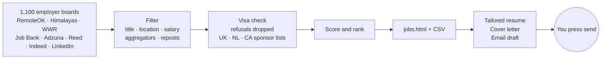

<p align="center">
  
</p>

<p align="center">
  <a href="https://github.com/anirudhprashant/huntline/actions"></a>
  
  
  
  
</p>

<p align="center">
  <b>Huntline</b> reads about 100,000 job postings a day, keeps the few that fit you,<br>
  and gets each one ready to apply with a tailored resume, a cover letter and an email draft.<br>
  Free, open source, runs on your laptop. It never sends anything without you.
</p>

<br>

<p align="center"></p>

## Why

Job boards show you everything. You need a short list. Huntline goes straight to the
source, about 1,100 employer career pages, and filters hard. Titles have to fit, salaries
have to clear your floor, and aggregators and reposts are dropped. Every job gets a score,
and the best ones come first.

If you need a visa, it goes further. Postings that say "no sponsorship" are removed. The
employers that remain are checked against official government sponsor lists, so a
posting that could actually hire you rises to the top.

## Quick start

You need **Python 3.10+** and **Chrome** (or Chromium, Edge or Brave).

```bash
pipx install huntline            # or: pip install huntline
mkdir my-job-hunt && cd my-job-hunt
huntline init                    # 7 quick questions
```

Put your real experience into `resume.yaml`. Then:

```bash
huntline scout                   # a few minutes the first time
```

Open **`out/jobs.html`**. That's your list.

## From list to application

```bash
huntline resume a1b2c3d0         # resume PDF tailored to that job
huntline letter a1b2c3d0         # one-page cover letter PDF
huntline drafts                  # email drafts for your top 10, both PDFs attached
huntline status a1b2c3d0 applied # track it
```

<p align="center">
  &nbsp;&nbsp;
  
</p>

## How it works



## What makes it different

| | |
|---|---|
| **Honest resumes** | Tailoring only reorders what you wrote. The most relevant bullet leads each role, and the most relevant skills come first. It never writes a claim you didn't make. |
| **Visa aware** | Checks the UK Home Office sponsor register, the Dutch IND register and Canada's LMIA employer lists, all downloaded straight from the government sources. Canada Job Bank postings that accept applicants without a work permit are ranked first. |
| **Straight from the source** | Greenhouse, Lever, Ashby, SmartRecruiters, Workable and Recruitee boards give the real employer and the full description, with no reposts. `huntline boards` finds more boards in your countries. |
| **You stay in control** | Drafts go to your Gmail Drafts folder, or become `.eml` files. Nothing is sent, and nothing is submitted for you. |
| **Doesn't fail silently** | If a source that usually returns results suddenly returns zero, you're told. |
| **Nothing to sign up for** | No account, no server, no paid API. Everything optional stays optional. |

## Optional extras

| Add | How |
|---|---|
| Indeed + LinkedIn | `pipx install "huntline[jobspy]"`, then add `jobspy` to `sources` |
| Adzuna (UK, CA, NL, DE, US, AU, IN) | Free key from developer.adzuna.com, set as `ADZUNA_APP_ID` + `ADZUNA_APP_KEY` |
| Reed (UK) | Free key from reed.co.uk/developers, set as `REED_API_KEY` |
| Drafts straight into Gmail | A Gmail [app password](https://myaccount.google.com/apppasswords), set as `GMAIL_ADDRESS` + `GMAIL_APP_PASSWORD` |
| AI-drafted cover letters | `huntline letter <id> --ai` with any OpenAI-compatible key: `OPENAI_API_KEY`, optionally `OPENAI_BASE_URL` + `HUNTLINE_MODEL` |

Put keys in a `.env` file in your folder (see `.env.example`). Run `huntline doctor` to
see what's set up.

**Countries:** Canada, UK, Netherlands, Germany, Ireland, USA, Australia, India and remote.

## Run it every morning

```bash
crontab -e
0 8 * * * cd ~/my-job-hunt && huntline scout
```

On Windows, use Task Scheduler: program `huntline`, arguments `scout`, start in your
folder. Each run adds only new jobs.

## Privacy

Your profile, resume, job database and generated files stay in your folder, and
`.gitignore` keeps them out of git. Huntline only talks to the job sources and
government registers listed above, plus Gmail or an AI provider if you turn those on.

## Good to know

- Some sites block cloud servers. Run Huntline from a home connection.
- Sponsor-list matching goes by company name. Treat a match as a strong lead, and
  confirm it before you rely on it.
- The contact email finder labels any guessed address. Check it before you send.

## Contributing

New job sources, countries and sponsor registers are the most useful additions. Each
source is one function in [`huntline/sources.py`](huntline/sources.py) that returns a list
of dicts. Run the tests with `python -m unittest discover -s tests`.

---

<p align="center">
  <br>
  Built by <a href="https://github.com/anirudhprashant">Anirudh Prashant</a> during his own job hunt. MIT licensed.
</p>
